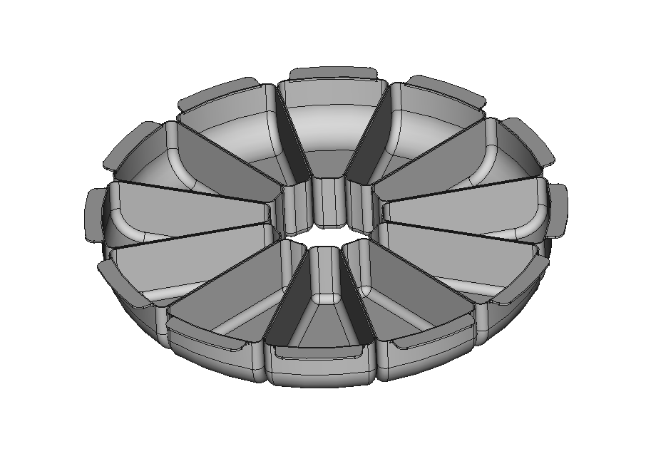
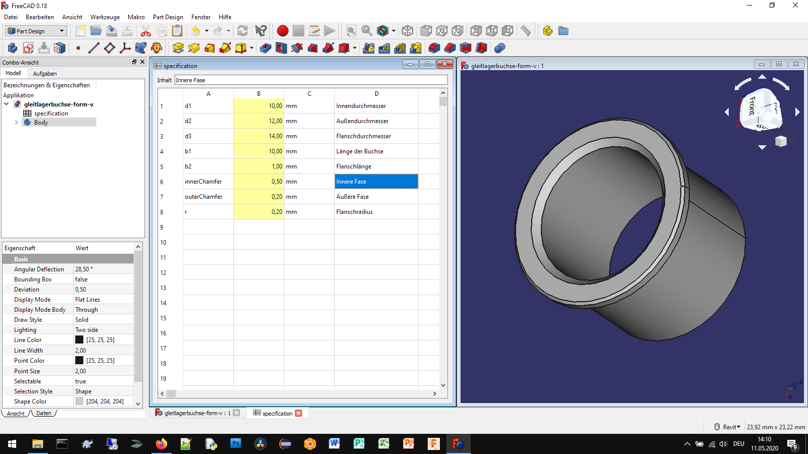

# FreeCAD Configurators

FreeCAD Configurators are parametric 3D models made in FreeCAD that have a set of user-modifiable predefined parameters.

## Why use FreeCAD Configurators
FreeCAD Confugurators allow you to quickly generate 3D models with similar attributes but different values of those attributes. CAD Configurators are generally used to capture the knowledge of products, parts and 3d models and to accelerate the development in mechanical engineering.

## Getting Started

To use a configurator you open it in FreeCAD, open the Spreadsheet "specification" and set the predefined parameters to your desired value. Not all combinations of parameter values are valid to rebuild the model without problems. After setting the desired parameter values the updated 3D model can be examined in the 3D View of FreeCAD. 

**Hint:** With the function window -> arrange in the FreeCAD menu the 3D model and the Spreadsheet can be viewed simultaneously

At last but not least the 3D model can be exported as a STEP file to use it in other applications.

These are the available FreeCAD configurators:

[**Epoxy Granite Machine Base**](epoxy-granite-base/)
The epoxy granite machine base configurator was created to get hobby machine builders started with development. The 3d model can be used to calculate the amount of epoxy granite material needed for the build and the weight of the final part.

[**Minigrip Vise Clamps**](minigrip-vise-clamps/)
The minigrip vise clamps solve the problem of limited space and not beeing able to mount two vises on small cnc milling machines.

[**Parts Catcher Bins**](parts-catcher-bins/)
The parts catcher bins configurator was created to help in the quality control process in production of small cnc turned parts.

[**Production Hall**](production-hall/)
The Production hall configurator was created to help in layout of machine positions in production halls.

[**Bearing Bushes**](bearing-bushes/)
This configurator was created as a sample projekct to intruduce people into the concept of parametric 3d models.

### Prerequisites

In order to run these configurators you need to have installed the latest stable version of FreeCAD, but at least version 0.18.4

You can get FreeCAD here:
https://www.freecadweb.org/downloads.php

## Authors

* **Aleksander Sadowski** - *Some of the configurators* - (https://github.com/alekssadowski95)
* **Dariusz Broniewicz** - *Some of the configurators*

Look into the license file of each configurator to find out who has made it.

## License

Each specific configurator is licensed under its own license. Each configurator is in its own folder. For information on the license of each configurator look into the corresponding folder of the configurator in question or klick on the coresponding link below. - see the [LICENSE.md](LICENSE.md) file for details

**Epoxy Granite Machine Base** - see the [LICENSE.md](epoxy-granite-base/LICENSE.md) file for details

**Minigrip Vise Clamps** - see the [LICENSE.md](minigrip-vise-clamps/LICENSE.md) file for details

**Parts Catcher Bins** - see the [LICENSE.md](parts-catcher-bins/LICENSE.md) file for details

**Production Hall** - see the [LICENSE.md](production-hall/LICENSE.md) file for details

**Bearing Bushes** - see the [LICENSE.md](bearing-bushes/LICENSE.md) file for details

## Acknowledgments

FreeCAD is Amazing!
