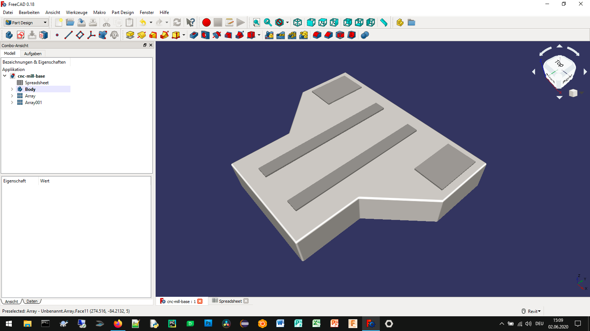
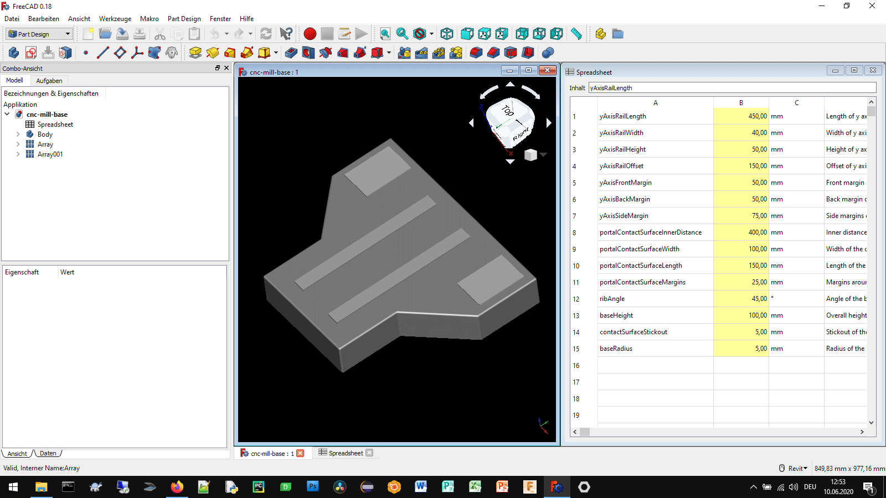

# Epoxy granite machine base

## How to use
Set the parameters of the epoxy granite machine base and use your own epoxy granite machine base model in your applications of need.

## Authors

* **Aleksander Sadowski** - (https://github.com/alekssadowski95)

## License
The epoxy granite machine base configurator (*.FCStd file) in this folder is licensed under the BSD 3-Clause License. - see the [LICENSE.md](LICENSE.md) file for details 

The documentation of the epoxy granite machine base configurator, including the manual but not limited to the manual, is licensed under a different license - see the [LICENSE.md](LICENSE.md) file for details

## Acknowledgments

FreeCAD is Amazing!
