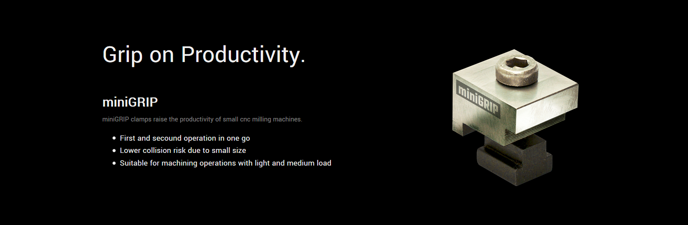
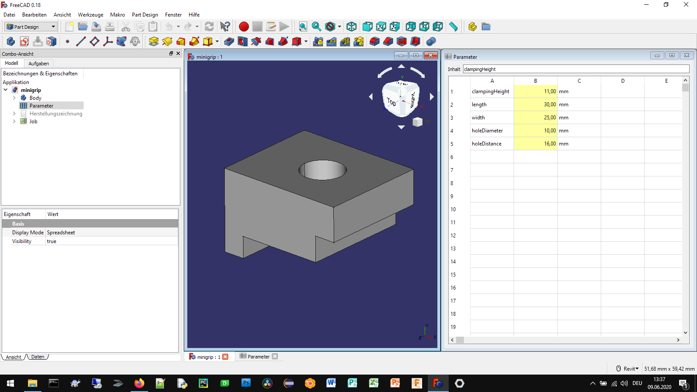
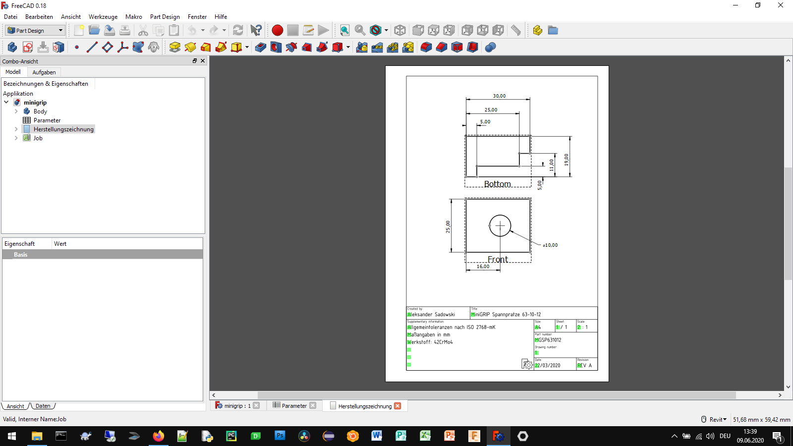
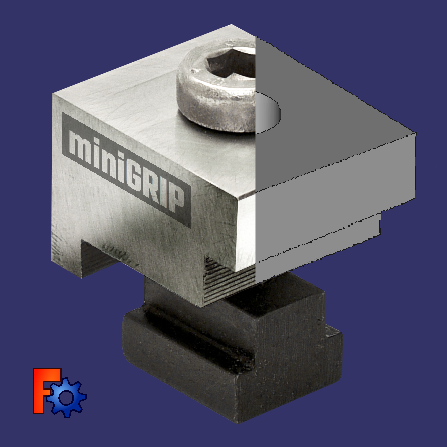

# Minigrip vise clamps - Prodictivity solution for small cnc milling machines

## How to use
**Set the parameters of the minigrip vise clamps that fit your specific vise.**

**Automatically Generate the production drawing and export it as a PDF-file**

**Create the production toolpaths and mill the minigrip vise clamps yourself**

## Authors

* **Aleksander Sadowski** - (https://github.com/alekssadowski95)

## License
The minigrip vise clamps configurator (*.FCStd file) in this folder is licensed under the BSD 3-Clause License. - see the [LICENSE.md](LICENSE.md) file for details 

The documentation of the minigrip vise clamps configurator, including the manual but not limited to the manual, is licensed under a different license - see the [LICENSE.md](LICENSE.md) file for details

## Acknowledgments

FreeCAD is Amazing!
