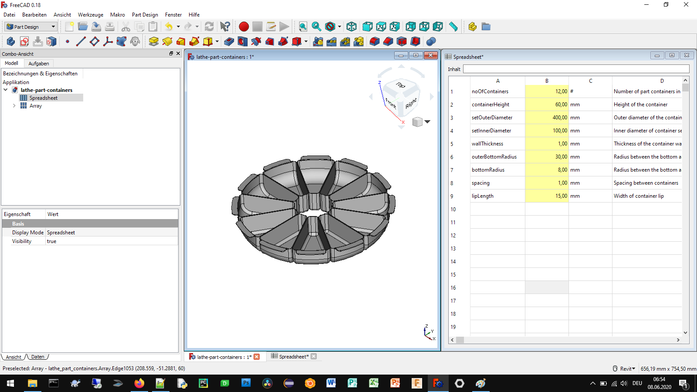

# Parts catcher bins - FreeCAD Configurator

## How to use
This parts catcher bins configurator was created to help in the quality control process in production of cnc turned parts.

## Authors

* **Aleksander Sadowski** - (https://github.com/alekssadowski95)

## License
The parts catcher bins configurator (*.FCStd file) in this folder is licensed under the BSD 3-Clause License. - see the [LICENSE.md](LICENSE.md) file for details 

The documentation of the parts catcher bins configurator, including the manual but not limited to the manual, is licensed under a different license - see the [LICENSE.md](LICENSE.md) file for details

## Acknowledgments

FreeCAD is Amazing!
