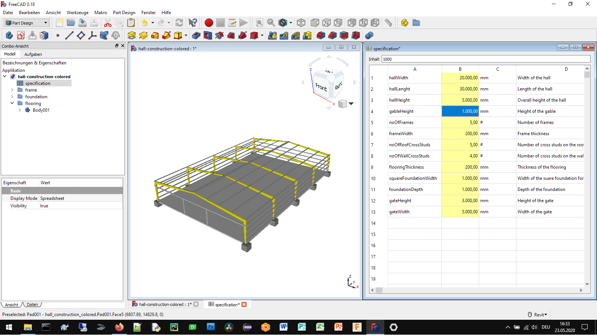

# Production hall - FreeCAD Configurator

## How to use
This Production hall configurator was created to help in the layout of machine positions in production halls. The model generated with this production hall configurator should never be used for structural calculations. The use of models, generated with this production hall configurator, for structural calculations may lead to damage, severe injuries or death

## Authors

* **Aleksander Sadowski** - (https://github.com/alekssadowski95)

## License
The production hall configurator (*.FCStd file) in this folder is licensed under the BSD 3-Clause License. - see the [LICENSE.md](LICENSE.md) file for details 

The documentation of the production hall configurator, including the manual but not limited to the manual, is licensed under a different license - see the [LICENSE.md](LICENSE.md) file for details

## Acknowledgments

FreeCAD is Amazing!
