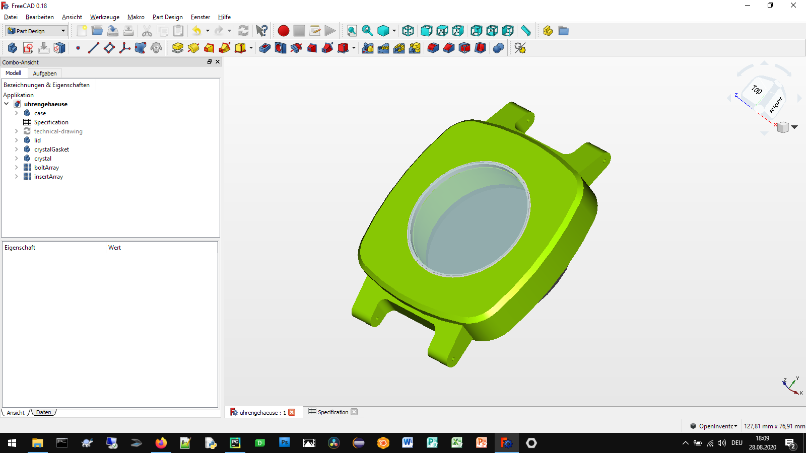
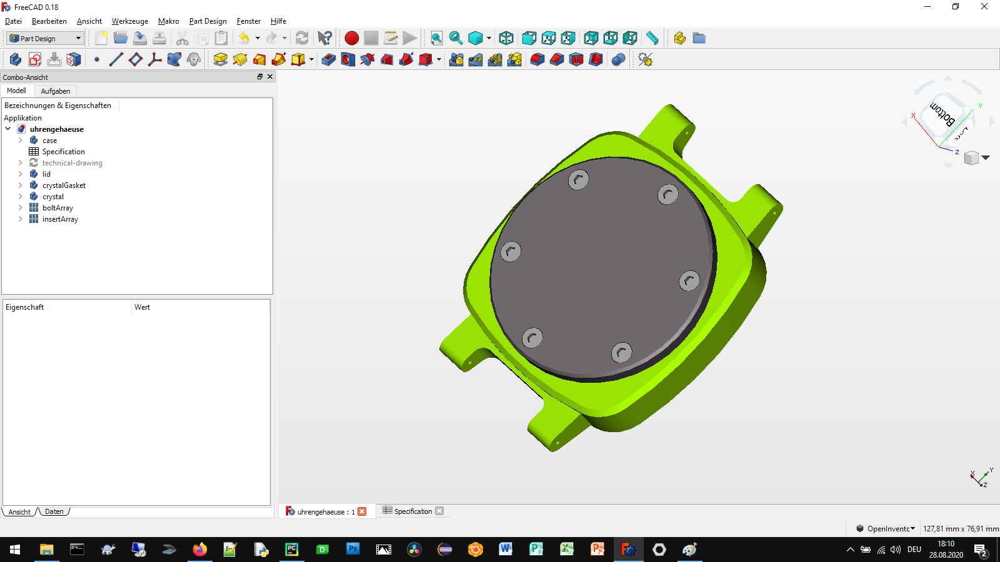
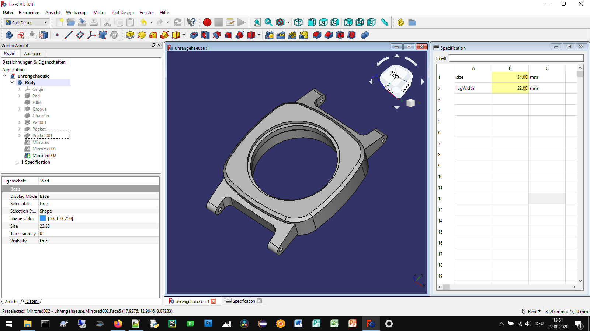
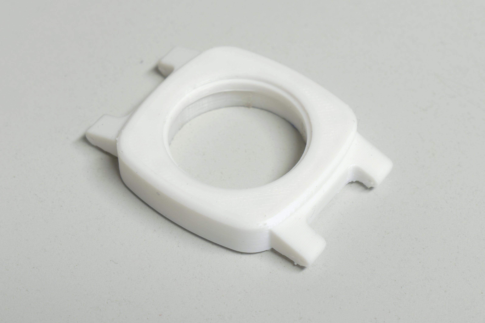

# 3D printable watch case 

## How to use
**Set the parameters of the watch case through the spreadsheet.**

**Export the 3D model for 3D printing**

**3D print your individual watch case at home**

## Authors

* **Aleksander Sadowski** - (https://github.com/alekssadowski95)

## License
The 3d printable watch case configurator (*.FCStd file) in this folder is licensed under the BSD 3-Clause License. - see the [LICENSE.md](LICENSE.md) file for details 

The documentation of the minigrip vise clamps configurator, including the manual but not limited to the manual, is licensed under a different license - see the [LICENSE.md](LICENSE.md) file for details

## Acknowledgments

FreeCAD is Amazing!
